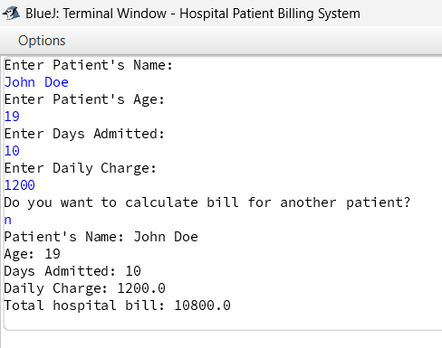

PROJECT TITLE: *Hospital Patient Billing System*

PURPOSE OF PROJECT: *To calculate and display total hospital bill of the patient*

VERSION or DATE: *20th January 2026*

AUTHORS: *Prajwal Rajbhandari*

**Hospital Patient Billing System** is a simple, console-based Java application designed to manage patient records and calculate hospital bills based on the duration of dtay and daily charges.

Features ⚙️
1. **Dynamic data entry** - allows users to enter details for multiple patients in a single session.
2. **Automated billing** - calcualtes total cost based on days admitted and daily charges.
3. **Discount logic** - automatically, applies a 10% discount if a patient is admitted for more than 7 days.
4. **Record Keeping** - uses Java ArrayList to store patient objects.
5. **Clean Console Output** - displays a formatted summary of each patient immediately after data entry.

Technical Stack 🧑‍💻
- **Java**

Concepts Used 💡
- **Conditional logic** (if-else)
- **Loops** (while, for-each)
- **Scanner class for user input**
- **Collection Framework** (ArrayList)

Example Output:

